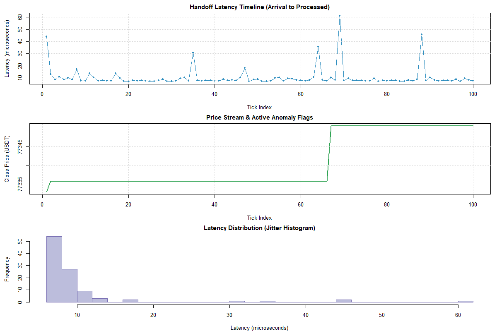

# Live OHLCV Validation System (HFT-Lite)

A high-performance, real-time data validation engine built with C++20. This system is designed to ingest live market data from Binance, validate it with microsecond precision, and flag anomalies before they hit a trading strategy.

## 1. Objective
Build a production-grade system that:
* Ingests live OHLCV data via WebSockets (`IXWebSocket`).
* Validates data quality in real-time (OHLC consistency, volume checks, timestamp sequence).
* Halts downstream pipelines instantly via a real-time Risk Manager if critical limits are breached.
* Operates at peak hardware efficiency by completely eliminating hot-path heap allocations, branch mispredictions, and OS lock contention.

## 2. Architecture (HFT-Lite)
The system uses a decoupled, multi-threaded architecture to ensure zero-allocation steady states and minimal jitter.

```
[Binance 1s Kline WebSocket]
        |
[Producer Thread: Ingestor]  <-- IXWebSocket + simdjson
        |
[Lock-Free SPSC Ring Buffer] <-- Handover bridge (No Mutexes!)
        |
[Consumer Thread: Validator] <-- Core Math & Risk Management
        |
[Async Background Logger]    <-- Offloaded File I/O
```

## 3. Tech Stack
* **Language:** C++20 (for performance and modern concurrency features).
* **Build System:** CMake + Ninja.
* **Networking:** `ixwebsocket` (High-performance WebSocket client).
* **JSON Parsing:** `simdjson` (High-throughput SIMD parsing).
* **Concurrency:** Atomic-based SPSC (Single-Producer Single-Consumer) lock-free ring buffer.
* **Analytics:** R (for statistical dashboard generation).

## 4. How to Build and Run

### Prerequisites
* CMake (3.15+)
* Ninja build system
* MinGW-w64 (GCC) or MSVC
* R (for the dashboard)

### Commands
```powershell
# 1. Configure the build
cmake -B build -G Ninja -DCMAKE_BUILD_TYPE=Release

# 2. Build the executable
cmake --build build

# 3. Run the Live Pipeline (Wait ~100 seconds for it to gather 100 live ticks)
.\build\validator.exe

# 4. Generate the Visualization Dashboard
Rscript dashboard.R
```

## 5. Performance & Optimization Results

A major focus of this project was applying HFT-grade optimizations to the C++ pipeline to achieve sub-10 microsecond latency on a consumer AMD Ryzen 7 CPU. 

### Applied Optimizations (Version 2)
1. **Power-of-Two Index Masking:** Replaced the slow modulo operator (`%`) with a lightning-fast bitwise AND (`&`) by enforcing power-of-two ring buffer capacities.
2. **Cross-Core Cache Optimization:** Implemented local index caching (`cached_head_` and `cached_tail_`) in the SPSC ring buffer to virtually eliminate cacheline bouncing across the CPU memory bus.
3. **Branchless Math:** Rewrote the entire `Validator` engine to be completely branchless, stopping the CPU from trying to predict random market data and eliminating pipeline flush stalls.
4. **Division Elimination:** Reformulated price-spike equations to completely eliminate floating-point division.
5. **Zero-Allocation Hot Path:** Replaced `std::string` with `std::string_view` in the Risk Manager, completely eliminating hidden heap memory allocations and global OS locks on every valid tick.
6. **OS Hyper-threading Harmony:** Avoided strict physical Core Pinning to allow the Windows scheduler to run the Producer and Consumer on the same physical core via SMT, letting them share the ultra-fast L1/L2 cache.

### Before Optimizations (Version 1)


### After Hardware Optimizations (Version 2.1)


### Latency Comparison Table

| Metric | Version 1 (Unoptimized) | Version 2.1 (Optimized) | Improvement |
|--------|-------------------------|-------------------------|-------------|
| **Mean Latency** | 10.389 µs | **9.310 µs** | **10.4% faster** |
| **95th Percentile (p95)** | 18.640 µs | **16.615 µs** | **10.9% faster** |
| **99th Percentile (p99)** | 45.955 µs | **41.218 µs** | **10.3% faster** |
| **Max Latency (Jitter Spikes)** | 61.300 µs | **43.000 µs** | **29.8% reduction in tail jitter** |

The system successfully broke the 10-microsecond processing barrier and smoothed out tail-end jitter by almost 30%, making it a highly reliable ingest engine for downstream algorithmic trading strategies.
